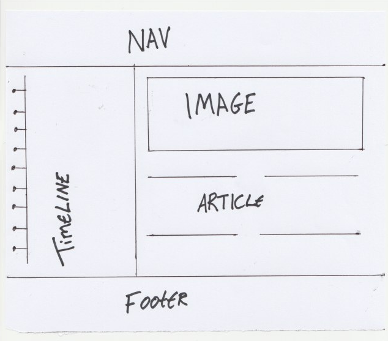
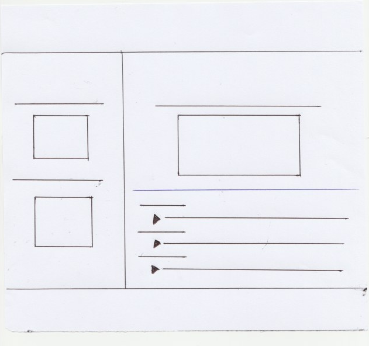
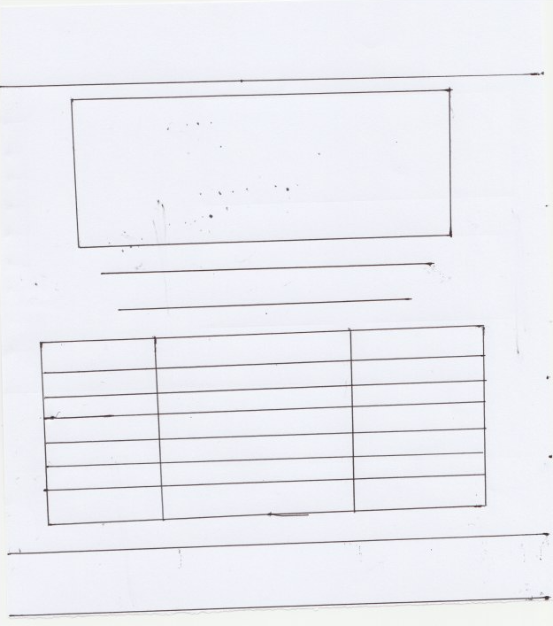
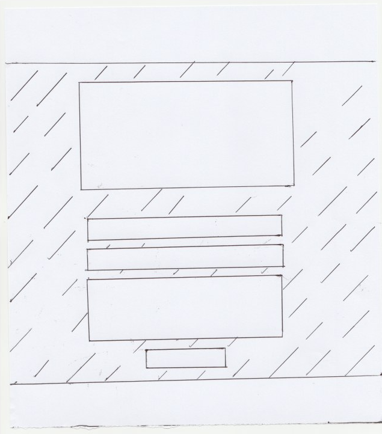

The Monkees Fan Page
===

**Milestone Project One: User-Centric Frontend Development - Code Institute.**

This is a fan page designed for both lovers and newcomers of the 1960s surf-rock band, The Monkees. Over four webpages, the website highlights the band’s retro appeal and stylistic relevance in the digital age. It briefly explores their history; their online presence through both social media and their ability to reach a new audience through platforms such as iTunes and Youtube, as well as their availability to perform on both their current tour and special events.

The project had personal interest to me as I am a musician myself. I have long been fascinated by the resurgence of decade-old bands through the power of the internet. We’ve seen it with bands such as The Rolling Stones and The Beatles who have enjoyed a definite boost in popularity and new lease on life as young fans have an easier time discovering their music and history through online resources. To me, The Monkees’ are another great example of a band whose style and appeal are just ripe for the tastes of young music and fashion lovers alike.

Demo
===

A live demo of this project can be found [here](https://martincurran28.github.io/the_monkees_fan_page_assignment/).

UX
===

My ultimate goal was to create a Monkees fan-page which would inform and educate both an existing fan-base and a new audience and generation unfamiliar with their work of what they have done and what they are presently doing through web design. I wanted to use this website as an opportunity to offer the user a great resource for the band and the band itself a good marketing tool and place to showcase their work to reach fans and curious users.

For the user who wants to learn more about the band’s history, the home page provides a brief timeline that condenses their story into minute bites and even travels vertically as a user scroll down the page. This is both an informative and efficient way to introduce the band’s story in a way that won’t overload the user with information. As well as this, the home page provides users with information for contacting the band and how to follow them through social media.

For any user interested in discovering, purchasing or simply listening to the band’s music, there’s the music page which displays a selection of albums available to purchase through iTunes with links to the relevant iTunes pages. For videos and band footage, there’s a link to their official Youtube channel along with an example of such a video users can expect from the channel.

Users who want to sample their music before visiting iTunes can also enjoy the MP3 tab at the bottom of the page which provides four of their best known tracks to enjoy at leisure while scrolling.

For information regarding tour dates and ticket availability for users who would like to see the band live, there’s a tour table which easily and comprehensively illustrates selected dates, venues and ticket status for each concert for their upcoming tour. As well as this, any users interested in which songs the band will be playing live can download the PDF file of their setlist before making any decision about purchase.

Users who wish to contact the band regarding an event or query can do so by visiting the contact page. The contact page will ask for a name, email and a brief description from the user form provided. 

You can find mockups of how this project was planned to look below and also in my Github under the **mockups** folder.

**index.html**

**music.html**

**tour.html**

**contact.html**

Features
===

In this section, I will describe the user available features which this project has to offer.

**Existing Features**

* **Navbar** – A clickable logo to the left of the page and four separate buttons which allows the user to navigate across all four available webpages.
* **Band Timeline** - Allows users to read and understand a brief history of the band.
* **“Who Are The Monkees” section** – Provides the user with a brief description of the band and the purpose of the website. 
* **iTunes Sidebar** – A visual selection of albums available from the band, each with a link to iTunes where they can purchase them. Also includes a clickable image of the Apple logo.
* **Youtube Showcase** – An embedded Youtube video along with a clickable Youtube icon which links the user to their Youtube page.
* **MP3 Player Section** – Another clickable Apple logo followed by a row of four MP3s of the band’s music, the audio of which is playable for the user.
* **Downloadable Setlist** – A PDF file of the band’s setlist that’s linked to a piece of text which is downloadable for any user. 
* **Tour Table** – A three column tour table presenting date, venue and ticket availability to the user along with a clickable button which takes the user to the Ticketmaster website.
* **Contact Form** – A form for getting in touch with the band and submit button.
  (Please note, for full tranperency, the contact form is not yet wired up to email information. It is a static form used for aesthetic purposes on the project.)
* **Footer** – Provides information on the band, a register trademark of the band name, and a row of social media links for users to find the band elsewhere.

Technologies Used
---

The following list contains all technologies used in the creation of this project.

* **HTML**
  * The project uses HTML as the mark-up language. 
* **CSS**
  * The project uses CSS to style the HTML elements.
* **Bootstrap**
  * Used to add further style and navigation to the project. Link provided [here]( https://getbootstrap.com/).
* **Font Awesome**
  * Used to add visual icons are certain points in the project. Link provided [here]( https://fontawesome.com/).
* **Google Fonts**
  * Used to add specific font families and weights to HTML text. Link provided [here]( https://fonts.google.com/).
* **Cloudflare** (Hoover.CSS)
  * Used to add a hoover effect to specific elements. Link provided [here]( https://www.cloudflare.com/lp/overview-x/?_bt=327494540339&_bk=cloudflare&_bm=p&_bn=g&_bg=65399306523&_displaycampaign=&gclid=Cj0KCQjwnKHlBRDLARIsAMtMHDGr_dQW0nL-HRrbbA6M3Z5gadRS-CUSg2Y_AwkYJ5Q7GbuD3COjE0UaAocdEALw_wcB ).

Testing
---

The user stories described in the UX section achieve the expected results of making the site a good resource for fans and people unfamiliar with their work to visit.  

On desktop, the user will see The Monkees Timeline functions as a side panel next to the left of the screen with a group photo of the band on the right and a text-based column of four below that photo. On tablet and mobile devices, the user’s page responds nicely, with the timeline becoming centred on the page with the band photo and four columns sitting underneath as the user scrolls down.
The user can travel between pages with ease using the navigation buttons in the navbar. The logo also poses as a conventional Home button. 
The user can be redirected to any of the relevant Monkees media sites by clicking the icons in the footer.

The user will notice that the music page has a very similar layout to Home in that it uses a side panel and main body which collapses underneath as the screen size decreases to fit mobile screens. Users can listen to the audio from the MP3 files by clicking the play symbol and the duration of their song will be noted by both a running timeline and a seconds counter. Volume is also adjustable on desktop, but only the option to mute the sound is available on mobile. The option to download any of the four Mp3 tracks is available to the user on all devices. 

The user can view the Tour Table on any device as it will shrink to size as the screen size decreases. Unfortunately, the option to download a PDF file of the setlist is not available on mobile devices. download option is availablle on desktop.

For complete transparency about this project, I wish to inform you that the contact form is static and a user can input information. It is not wired to store the accepted information or have the relevant email sent the admin of the site to inform them of the contact form. For now, as the relevant knowledge to wire it up is not part of the User-Centric Frontend module, it remains a static form for the sake of aesthetics on the project. 
It is, however, responsive to the user’s actions. If the user fails to input information into every relevant box and then clicks the send button, a warning sign will pop up under the relevant boxes which need to be completed. The contact form itself is also responsive to changing screen sizes.

Each page of the site was tested across three different browsers (Google Chrome, Safari, Firefox) on multiple mobile devices (iPhone 6, 7, 8, iPad, iPad Pro, Pixel, Pixel 2, Samsung Galaxy) to ensure compatibility and responsiveness. During the testing phase, I realized that the music page was not responding appropriately to what I expected. The Youtube and MP3 sections were pushing the margin-right further out, leaving the page with too much space to the right of the screen. Media Queries for screen size were utilized as this problem was concerning for the iPad and mobile screens. I used `@media only screen and (max-width: 400px)`for mobiles and `@media only screen and (min-width: 768px) and (max-width: 990px)` for the iPad to solve this problem.

Deployment
===

This site is hosted using GitHub pages, deployed directly from a separate git branch called “gh-pages” as opposed to the master branch. Through the command line, I created the new branch by using this command: `git checkout –b gh-pages`. I then push my branch using `git push origin gh-push`. After inputting my GitHub credentials, I was given the URL to the deployed page where my project was hosted.

I have never deployed a project to GitHub Pages so I opted to create the second branch out of fear and safety for my work. I will have to change branch to update the website using `git checkout [branch]`, but this is only a minor inconvenience.

To run this code locally, you may clone this repository from the **Clone or Download** button at the top of the page and writing git clone followed by that URL you have cloned into an editor. To cut ties with Github use `git remote rm origin` in your terminal.

Credits
===

**Content**

* All content in the "About Us” and Monkees’ Timeline sections of this project were written by me with facts referenced and researched through The Monkees’ [Wikipedia]( https://en.wikipedia.org/wiki/The_Monkees).

**Media**

* The photos, images and Mp3s used and displayed on this site were obtained from [this]( https://github.com/Code-Institute-Org/project-assets/tree/master/stream-1/band-assets) Github repository and Google Images.
* The video for “Daydream Believer” was embedded courtesy of Youtube and a link to the official video url can be found [here]( https://www.youtube.com/watch?v=xvqeSJlgaNk).

**Acknowledgements**

* A very useful tutorial on how to deploy the project using GitHub Pages.Click [here](https://www.youtube.com/watch?v=TUJekd0reVQ) for the video.  
* My responsive Youtube video was made possible through [this video](https://www.youtube.com/watch?v=9YffrCViTVk).
* Further credit should go to W3School for showing me how to correctly implement the MP3s found in the “tour.html” page. Click [here]( https://www.w3schools.com/html/html5_audio.asp) for the audio tutorial.

* The full navbar I used was sourced from StartBootstrap and you can find the full HTML and CSS code [Here](https://startbootstrap.com/snippets/navbar-logo).
* Along with some experimentation on the style, the tour table structure found in “tour.html” is credited to an incredibly helpful W3School tutorial that can be found [here]( https://www.w3schools.com/html/html_tables.asp).
* I received inspiration from a number of sources for this project. I was curious as to how other bands of the same era were now marketing their online presence. I found the official website for The Rolling Stones to be a big influence. The developer of that website seemed to understand the importance of finding balance between respecting their history, but also contextualising and branding it as something very relevant and new. I see it in how they used font and colour, even shape to evoke something nostalgic through the design, but still keep it very lively and intriguing to coax someone unfamiliar with the band to journey further into the site. You can take a look [here](https://www.rollingstones.com/).
* A special thanks to the lecturers and coordinators at Code Institute for their tutorials and instruction through the User-Centric Frontend Development module. Their website can be found [here](https://codeinstitute.net/)
* Lastly, to my parents, Seamus and Susan, for their constant support and help throughout the prep and creation of this Milestone project.
